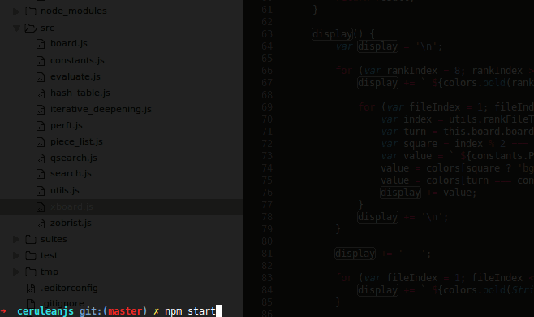

# CeruleanJS by Joey Robert
                                 ___
                                /\_ \
      ___     __   _ __   __  __\//\ \      __     __      ___
     /'___\ /'__`\/\`'__\/\ \/\ \ \ \ \   /'__`\ /'__`\  /' _ `\
    /\ \__//\  __/\ \ \/ \ \ \_\ \ \_\ \_/\  __//\ \L\.\_/\ \/\ \
    \ \____\ \____\\ \_\  \ \____/ /\____\ \____\ \__/.\_\ \_\ \_\
     \/____/\/____/ \/_/   \/___/  \/____/\/____/\/__/\/_/\/_/\/_/

Official Site: http://ceruleanjs.joeyrobert.org/

## Introduction

CeruleanJS is a chess engine for NodeJS. The goal of CeruleanJS is threefold:

* Correctness
* Performance
* Ease of programming

CeruleanJS aims to be ranked on the CCRL.

## Requirements

* Node >= 4.0

## Setup

To install the binary into your $PATH, install the ceruleanjs package
globally:

    npm install -g ceruleanjs

Run the engine with the command:

    ceruleanjs

If you're installing from sources, check out this git repository and run:

    npm install

To run:

    npm start

To run mocha tests:

    npm test

To generate a binary executable for your current platform (using nexe), run:

    npm run build

This will generate a binary executable `ceruleanjs` in `dist`.

## Interface

CeruleanJS supports the xboard/winboard/CECP format for communicating with
interfaces or other chess engines. It's also usable directly through
STDIN/OUT. Here's the list of commands:

    Commands
    --------
    display         Draws the board
    perft [INT]     Perfts the current board to specified depth
    divide [INT]    Divides the current board to specified depth
    moves           Lists valid moves for this position
    e2e4            Moves from the current position and thinks
    go              Forces the engine to think
    undo            Subtracts the previous move
    new             Sets up the default board position
    setboard [FEN]  Sets the board using Forsyth-Edwards Notation
    evaluate        Performs a static evaluation of the board
    white           Sets the active colour to WHITE
    black           Sets the active colour to BLACK
    time [INT]      Sets engine's time (in centiseconds)
    otim [INT]      Sets opponent's time (in centiseconds)
    sd [INT]        Sets maximum depth
    st [INT]        Sets maximum time
    exit            Exits the menu
    quit            See exit
    help            Gets you this magical menu

## Interface GIF

## Technical

For a more technical breakdown of how CeruleanJS is implemented, [see
docs/TECHNICAL.md](docs/TECHNICAL.md)

## License

CeruleanJS is licensed under the GNU GPL v2.