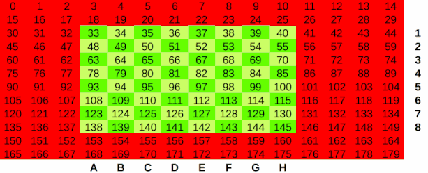

# CeruleanJS Technical Information
                                 ___
                                /\_ \
      ___     __   _ __   __  __\//\ \      __     __      ___
     /'___\ /'__`\/\`'__\/\ \/\ \ \ \ \   /'__`\ /'__`\  /' _ `\
    /\ \__//\  __/\ \ \/ \ \ \_\ \ \_\ \_/\  __//\ \L\.\_/\ \/\ \
    \ \____\ \____\\ \_\  \ \____/ /\____\ \____\ \__/.\_\ \_\ \_\
     \/____/\/____/ \/_/   \/___/  \/____/\/____/\/__/\/_/\/_/\/_/

## Board represention

15x12 board is used for. Piece lists for each side handle board state.
The board representation is visualized below:

An interactive form of this visualization is available in board.ods. Every
legal position on the board is a piece value or EMPTY in JavaScript. Positions
outside the legal board (8x8) are defined as OUT_OF_BOUNDS. This is the
sentinal value that tells us when a square is within the bounds of the board,
as in the [Mailbox](http://chessprogramming.wikispaces.com/Mailbox) board
representation.

### Conversion

Board indices, rank and file can be converted to one another using the
following functions:

    index = rank * 15 + file + 17
    rank = floor(index / 15 - 1)
    file - (index - 3) % 15 + 1

## Piece representation

Pieces are represented as follows:

    Pawn   0
    Knight 2
    Bishop 4
    Rook   6
    Queen  8
    King   10
    Empty  12

The turn of the piece is represented as the least significant bit, 1 for
white, 0 for black.

## Move representation

Moves are represented as a 32-bit integer with the following fields:

    ORDER     BIT CAP PRO TO      FROM
    000000000 000 000 000 0000000 0000000
    ^ MSB                           LSB ^

This breaksdown to the following distribution:

* 7 bits for FROM index
* 7 bits for TO index
* 3 bits for PROmotion piece (Q/R/B/N)
* 3 bits for CAPtured piece (any or empty)
* 3 bits for BITs (metadata)
* 6 bits for ORDERing

This dense move structure requires less data to be saved on the board's
internal history array.

For captured and promotion pieces, the number represents the base-2 logarithm
of the piece type.

BITS is metadata set by the move generate about what type of move this is. The
BITS property is defined as follows:

    1  capture             (001)
    2  castling            (010)
    3  en passant          (011)
    4  pawn move           (100)
    5  double pawn move    (101)
    6  promote             (110)
    7  promote and capture (111)

## Zobrist hashing

### Version 0.0.1 (Azure)

JavaScript lacks a 64-bit integer type. It does contain a 64 bit floating
point number, of which 53 bits can be used to precisely save an integer.
Bitwise operations in JavaScript only work on 32-bit integers, meaning no XOR
for 53 bits. However using a combination of additions and subtracts, we can
implement zobrist hashing without an exclusive or.

A 53-bit additive zobrist key is generated for each board position through the
sum of all pieces pieces on squares with colours, en passant position,
castling rights and side to move. Each additive value is up to 48 bits. There
are a maximum of 38 values in the zobrist sum:

* 32 pieces by square by color
* 4 castling rights (KQkq)
* 1 en passant position
* 1 side to move

This should be enough to uniquely describe the board position, with a
collision frequency of one in 2^24 (16,777,216) boards. With the chosen random
seed, the max zobrist sum possible in this scheme is 7,827,150,971,215,194
(less than the max JS safe integer size of 9,007,199,254,740,991). This number
does not account for maximum *legal* position, only a sum of the 38 largest
integers generated.

This architecture was inspired by
[this paragraph](https://chessprogramming.wikispaces.com/Zobrist+Hashing#Collisions-When%20you%20lack%20a%20true%20integer%20type)
on zobrist keys in the Chess Programming Wiki.

### Version 0.1.0 (Blizzard)

CeruleanJS uses 2 32-bit integers (`hiHash` and `loHash`). The reasons for
switching from 1 64-bit floating point number are:

* Integer XOR operations prove to be faster than floating point addition/subtraction
* Improved resilience against collisions (One collision every ~2^32 vs. ~2^24 for float)

In addition, CeruleanJS uses the
[Polyglot opening book format](http://hardy.uhasselt.be/Toga/book_format.html),
which standardizes the Zobrist keys and how they're generated.

## Move ordering

Move ordering is done using ~~Static Exchange Evaluation (SEE), inspired by
[Mediocre's guide](http://mediocrechess.sourceforge.net/guides/see.html) on
the subject~~ [MVV/LVA](https://chessprogramming.wikispaces.com/MVV-LVA). The
primary alpha-beta search uses iterative-deepening to put the best move from
the previous iteration first.

## Opening book

### Version 0.0.1 (Azure)

CeruleanJS uses the [Amundsen](http://www.bergbomconsulting.se/chess/) opening
book format and is distributed with a small opening book. An opening book
transposition table is used to select moves. Moves are chosen randomly if
there are multiple moves for a certain board position. This allows
CeruleanJS's gameplay to be non-deterministic.

CeruleanJS looks in `./book.bok` and `./suites/bok/small.bok` (in that order)
for the opening book. Reading a large opening book may be prohibitively slow
at startup.

### Version 0.1.0 (Blizzard)

CeruleanJS can use any standard Polyglot opening book. It's only dependency is
the npm package [ceruleanjs_opening_books](https://bitbucket.org/joeyrobert/ceruleanjs_opening_books).
It currently doesn't support the `weight` parameter in Polyglot opening books
and simply selects equivalent moves at a transposition manually.

It looks for books in `./book.bin` and `./node_modules/ceruleanjs_opening_books/gm2001.bin`.